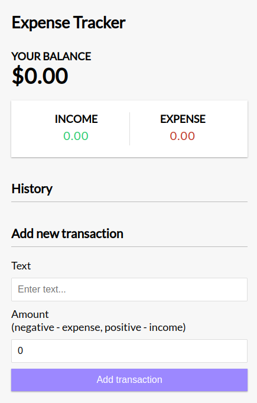

# Expense Tracker App

This Expense Tracker is a simple React application that helps users track their expenses and manage their finances by adding, viewing, and deleting expenses with an automatically updated balance. Built with React, it uses local state management to handle user interactions seamlessly.

## Features

- **Add Transactions**: Enter income or expense transactions with amounts and descriptions.
- **Calculate Balance**: Automatically calculates and displays the total balance, income, and expenses based on transactions.
- **Track Expense History**: Displays a list of all transactions with amounts.
- **Delete Transactions**: Easily delete any transaction from the list.
- **Data Persistence**: Stores transaction data in local storage so it persists even after refreshing the page (if implemented).

## Demo

![Expense Tracker Screenshot]



## Getting Started

Follow these instructions to get a copy of the project up and running on your local machine for development and testing.

### Prerequisites

- Node.js and npm (or yarn) installed on your local machine.

### Installation

1. Clone the repository:
   ```bash
   git clone https://github.com/your-username/expense-tracker.git

   cd expense-tracker

   npm install

   npm start


